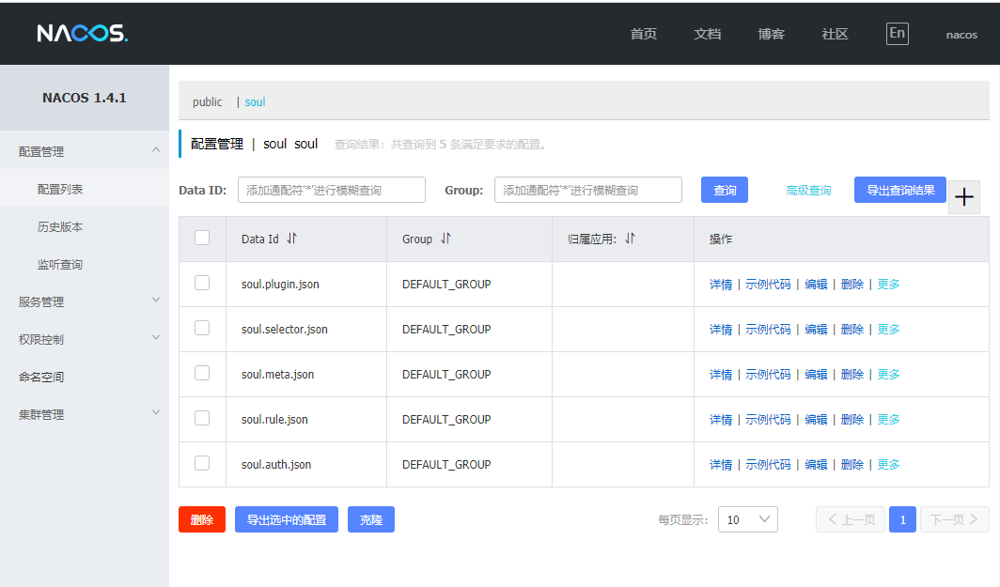

# Soul网关源码阅读（十六）Nacos数据同步示例运行
***
## 简介
&ensp;&ensp;&ensp;&ensp;本篇文章来探索下Soul网关的Nacos数据同步的示例运行，由于目前感觉这个nacos对新手不是太优化，而且目前感觉可能是有bug的，所有单独写一篇详解如果配置，为下一步进行源码解析，排查其中的问题打下基础

## 示例运行
**本篇文章问题基于2021.1.23日的soul最新代码版本**

### nacos、mysql docker 启动
&ensp;&ensp;&ensp;&ensp;我们使用docker启动一个nacos 和 mysql

```shell script
docker run --name mysql -p 3306:3306 -e MYSQL_ROOT_PASSWORD=123456 -d mysql:latest

# 管理界面用户名和密码：nacos nacos
git clone https://github.com/nacos-group/nacos-docker.git 
cd .\nacos-docker\
docker-compose -f example/standalone-derby.yaml up
```

&ensp;&ensp;&ensp;&ensp;访问nacos界面：127.0.0.1:8848 ，如果是正常的，就能看到下面五个数据配置，那恭喜你，你的是正常运行的。如果是空的，那说明你和我遇到了一样的问题：



### 问题场景描述
&ensp;&ensp;&ensp;&ensp;然后我们把admin、example-HTTP、Bootstrap启动起来，可能会遇到下面的问题之一：

- 1.都能正常启动，但nacos界面是空的，Bootstrap访问失败，没找到相应的数据
- 2.bootstrap启动失败，说读取数据为空

### 正确配置Nacos
#### Bootstrap配置
&ensp;&ensp;&ensp;&ensp;首先确保你的maven依赖开启了nacos-start，如下，如果没有的其添加进去

```xml
        <!-- soul data sync start use nacos-->
        <dependency>
            <groupId>org.dromara</groupId>
            <artifactId>soul-spring-boot-starter-sync-data-nacos</artifactId>
            <version>${project.version}</version>
        </dependency>
```

&ensp;&ensp;&ensp;&ensp;再来配置配置文件，强调：把其他的同步方式都给关了，只留下Nacos，并且修改Nacos同步配置，去掉acm相关的都行，都给注释掉！我们使用新的命名空间soul，方便查看数据

```xml
soul:
    file:
      enabled: true
    corss:
      enabled: true
    dubbo :
      parameter: multi
    sync:
#        websocket :
#             urls: ws://localhost:9095/websocket
#        zookeeper:
#             url: localhost:2181
#             sessionTimeout: 5000
#             connectionTimeout: 2000
#        http:
#             url : http://localhost:9095
        nacos:
              url: localhost:8848
              namespace: soul
#              acm:
#                enabled: false
#                endpoint: acm.aliyun.com
#                namespace:
#                accessKey:
#                secretKey:
```

&ensp;&ensp;&ensp;&ensp;如果运行起来，报错是读取数据是Null，那说明配置成功，下面接着配置其他的

### Admin配置
&ensp;&ensp;&ensp;&ensp;首先确保引入了Nacos-client依赖，如果没有，请进行添加：

```xml
        <dependency>
            <groupId>com.alibaba.nacos</groupId>
            <artifactId>nacos-client</artifactId>
            <version>${nacos-client.version}</version>
        </dependency>
```

&ensp;&ensp;&ensp;&ensp;配置文件也是，其他的同步方式都关闭，只留下Nacos，并修改命名空间为soul，注释掉acm相关（PS：进行debug的时候发现websocket好像也是开启的，感觉有点奇怪，但没有细看）

```xml
soul:
  database:
    dialect: mysql
    init_script: "META-INF/schema.sql"
    init_enable: true
  sync:
#    websocket:
#      enabled: false
#      zookeeper:
#          url: localhost:2181
#          sessionTimeout: 5000
#          connectionTimeout: 2000
#      http:
#        enabled: true
      nacos:
        url: localhost:8848
        namespace: soul
#        acm:
#          enabled: false
#          endpoint: acm.aliyun.com
#          namespace:
#          accessKey:
#          secretKey:
```

&ensp;&ensp;&ensp;&ensp;可以试着启动下Admin和example-HTTP，看看有没有错，没有的话，继续下面的

### Nacos配置
&ensp;&ensp;&ensp;&ensp;进入Nacos管理界面，用户名和密码：nacos nacos

&ensp;&ensp;&ensp;&ensp;在左边菜单栏中进行命名空间，选择新建命名空间，全部填写soul，建立soul的命名空间

&ensp;&ensp;&ensp;&ensp;这个时候再重启Admin和HTTP示例，在配置管理--配置列表中，在上方有一个命名空间的名称，public和soul。点击切换到soul，不出意外的话，也是啥也没有

### 手动同步数据
&ensp;&ensp;&ensp;&ensp;经过前面文章，我们知道有五种数据：插件数据、选择器数据、规则数据、元数据、认证管理数据

&ensp;&ensp;&ensp;&ensp;下面我们进入Admin后台管理界面，分别进入元数据、认证管理界面、插件管理，点击同步数据，然后掉级nacos页面的查询，发现出现了auth、meta、plugin相关的数据

&ensp;&ensp;&ensp;&ensp;这个时候如果重启了HTTP示例，可能也会出现selector和rule的数据，但我们尝试访问接口：http://127.0.0.1:9195/http/order/findById?id=1111 ，会发现找不到rule

&ensp;&ensp;&ensp;&ensp;这个时候，我们需要点击相应的rule，进行修改，那它就会同步到nacos里面去，再次访问接口就能正常返回了

&ensp;&ensp;&ensp;&ensp;这样，基本能跑一下，但问题还是很大，最大的问题是没有自动同步全量数据，需要手工同步

## 总结
&ensp;&ensp;&ensp;&ensp;本篇文章，记录了一次Nacos运行不成功的不完美的解决方法，后面需要进一步的进行源码探究，看看问题